# 面向预测不确定性与波动电价的光储微电网多时间尺度协调调度

## 摘要

针对含光伏与储能的并网微电网购电决策问题，本文围绕“日前计划—日内调整—实时补缺”构建统一的多时间尺度协调运行框架。首先，在单日负荷、光伏预测与分时电价确定的条件下，建立10分钟尺度连续线性规划模型，刻画电网购电、光伏消纳、储能充放电及荷电状态之间的耦合关系。其次，针对全年源荷不确定性，采用严格非前视的梯度提升模型直接预测净负荷，并将预测结果输入日前线性规划，再用实际轨迹回放紧急购电。随后，利用每日0:00、6:00、12:00、18:00更新的光伏预测，建立带经验分位安全裕度的滚动调整模型；最后，在逐日电价波动条件下，仅利用决策时刻之前的历史价格构造情景，以所选情景集合中的最坏合同费用为目标重新优化问题2和问题3。

计算结果表明：问题1中，连续线性规划的单日购电费用为35126.95元，较无储能基线降低26.90%，50 kWh网格动态规划与其费用差距为0.79%。问题2中，梯度提升模型的RMSE和MAE分别为451.70 kW和312.31 kW，334天综合费用为16865002.84元；相对前日持久性基线，综合费用和紧急购电量分别下降25.88%和54.88%。问题3选择安全分位数0.99后，相对不调整方案，紧急购电量下降17.50%，但综合费用增加3.58%，说明该参数对应风险优先而非最低费用方案。问题4中，历史价格情景策略不存在未来价格泄漏，其问题4-3综合费用为18405519.64元，比价格oracle参照高149161.64元，差额约占参照费用的0.82%。7日移动块Bootstrap与四季分组检验支持问题2费用优势及问题3费用—风险方向在本年度内保持一致。各主模型均满足储能边界、期末状态和能量平衡要求，且未出现同时充放电。

本文的主要工作特点是以同一物理内核贯通四个递进问题，并将预测误差、非对称调整结算、紧急购电惩罚和非前视价格情景统一纳入可复核的优化—回放链路。结果同时显示，预测精度改善能够转化为运营费用优势，但更保守的安全裕度并不必然改善费用尾部。因此，微电网调度应联合评价经济性、供电缺口风险与信息可实施性，而不能仅依据单一预测误差或单一紧急购电指标作出判断。

**关键词：** 光储微电网；多时间尺度调度；净负荷预测；滚动优化；分位安全裕度；鲁棒优化

## 1 问题重述

研究对象为由小区负荷、光伏发电、储能系统和外部电网构成的并网微电网。外部电网可以按照给定电价向微电网供电，光伏优先用于满足负荷或为储能充电，储能则通过跨时段充放电实现能量转移。当计划购电和内部供能不足时，系统必须以正常电价5倍的价格紧急购电。随着问题逐步扩展，负荷、光伏和电价由确定曲线转变为只能逐步观测的随机轨迹，决策也由单次日前计划扩展为日内滚动调整。

问题1要求在给定典型日负荷、光伏预测和固定分时电价下，制定144个10分钟时段的购电及储能计划，使全天购电费用最小，并保证日初与日末储能量相同。问题2将运行范围扩展到2025年2月1日至12月31日，共334天；每天0:00只能利用当时已知的历史数据制定计划，当日真实负荷和光伏仅用于执行和结算。问题3进一步给出每日四次光伏预测，要求判断是否应利用新预测调整尚未执行时段的购电和储能计划，并按照下调退款、上调溢价和紧急购电三类价格结算。问题4用逐日波动电价替换固定分时电价，分别复算问题2和问题3，同时要求未来真实电价不能提前进入可实施策略。

四问并非彼此独立：问题1提供统一的能量平衡、储能状态和费用口径；问题2在此基础上加入预测与实际执行；问题3继承问题2的日前计划并增加滚动调整；问题4只改变价格信息层，在控制其他条件一致的情况下考察价格波动的影响。

## 2 问题分析

问题1具有确定性运行机制和费用优化两个层面，可表述为“机制—优化”问题。其关键不是寻找复杂算法，而是严格处理kW与kWh换算、充放电效率、储能运行边界以及首末状态闭合。由于目标和约束均为线性关系，连续线性规划可以直接给出给定条件下的全局最优解；无储能模型用于衡量储能价值，离散动态规划用于数值交叉验证。

问题2是“预测—优化”混合问题。日前计划质量取决于目标日净负荷预测，而预测误差又通过5倍紧急购电价格影响实际费用。因此，方法选择不能只比较RMSE，还必须把预测结果输入同一个优化器，在统一实际轨迹上比较综合费用、紧急购电量和物理可行性。为防止未来信息泄漏，模型按日期滚动训练，目标日数据不进入训练和日前决策。

问题3仍属于“预测—优化”混合问题，但信息在日内多次更新。点预测滚动优化能够追踪最新光伏趋势，却可能在光伏被高估时留下供能缺口。本文用历史光伏高估误差分位数构造安全裕度，并把已执行时段冻结，只重新优化剩余区间。参数分位数越高，计划越保守；其收益是减少紧急购电，代价是增加计划和调整费用，因此需通过费用—风险前沿选择参数。

问题4属于“情景分析—优化”混合问题。附件4的未来真实价格只在时段实现后可用于结算，不能作为日前输入。故本文从决策日前的历史价格中抽取情景，求解最坏情景合同费用最小的鲁棒线性规划；同时保留使用未来真实价格的价格oracle作为不可实施参照，但它仍面对净负荷预测误差，不能视为实际综合费用的严格下界。总体依赖链为：确定性物理内核→非前视日前预测与执行→日内滚动调整→历史价格情景鲁棒重算。

现有研究分别从分时电价下储能调度、预测不确定性和多时间尺度协调三个方向讨论微电网运行[1-3]。梯度提升为非线性净负荷映射提供了成熟的函数逼近框架[4]；两阶段模型预测控制说明“预测—计划—更新—再优化”适合处理可再生能源扰动[5]；鲁棒优化则强调可实施性与保守代价之间的权衡[6]。本文不照搬文献中的设备或算法，而是依据题设的线性物理关系和结算规则，将上述思想压缩为可复核的统一优化—回放框架；CVaR仅作为事后尾部评价指标，其含义遵循离散损失分布下的定义[7]，不宣称已被直接纳入LP目标。

## 3 模型假设

为保证模型定义清晰并与题面信息边界一致，作如下假设。

1. 附件中的负荷、光伏和电价可视为竞赛系统的有效观测，不额外校正传感器偏差；原始文件经完整性、缺失值和数值范围审计后直接只读使用。
2. 各时间标签表示相邻10分钟区间的平均功率，并按照已确认的区间起点口径映射；功率乘以$\Delta t=1/6$ h后转化为时段电量。
3. 微电网不向外网售电，富余光伏允许弃用。若现实中允许上网交易，则需增加售电变量和上网电价，本文结论不再直接适用。
4. 储能除充、放电效率外不考虑自放电、容量衰减和寿命成本；单个10分钟时段内采用恒功率近似。
5. 不考虑需量电费、线路容量、网络损耗、无功功率及机组启停成本，研究结论限于题设简化微电网。
6. 同一时段不进行无意义的同时充放电。连续线性规划求解后逐时审计该条件，若出现异常则需升级为含二元变量的混合整数模型。
7. 问题2至问题4严格遵守非前视边界：目标日未来真实负荷、光伏和电价均不得提前进入决策；实现后的数据可用于当期执行、结算及后续更新。
8. 问题3中预测发布后只调整尚未执行时段；最终调整购电量仅与0:00原计划比较一次，不对多次变更重复结算。
9. 问题2至问题4的储能状态跨日连续，不要求每日回到固定值；为削弱有限时域末端效应，研究期末储能量固定为6000 kWh。
10. 历史源荷规律和历史价格情景对相邻时期具有一定代表性。发生结构突变或历史未覆盖的极端价格时，预测误差和鲁棒策略风险可能上升。

## 4 符号说明与公共模型

设日期集合为$\mathcal D$，日内10分钟时段集合为$\mathcal T=\{1,\ldots,144\}$，预测发布时刻集合为$\mathcal R=\{0,6,12,18\}$。$l_{d,t}$、$v_{d,t}$和$p_{d,t}$分别表示负荷电量、光伏电量和电价；$g^P_{d,t}$、$g^A_{d,t}$和$g^E_{d,t}$分别表示计划、调整后和紧急购电量；$x^c_{d,t}$、$x^d_{d,t}$为充、放电量；$E_{d,t}$为时段初储能量。主要常数如下。

| 参数 | 含义 | 数值 |
|---|---|---:|
| $E^{\max}$ | 储能额定容量 | 12000 kWh |
| $E^{\min}_{op},E^{\max}_{op}$ | 运行储能量上下限 | 1200、10800 kWh |
| $P^{\max}_{bat}$ | 最大充放电功率 | 5000 kW |
| $\eta_c,\eta_d$ | 充、放电效率 | 0.9、0.9 |
| $\kappa_E$ | 紧急购电价格倍数 | 5 |
| $\kappa_-,\kappa_+$ | 下调退款、上调增购倍数 | 0.5、1.5 |

四问共享储能状态方程

$$E_{d,t+1}=E_{d,t}+\eta_cx^c_{d,t}-\frac{x^d_{d,t}}{\eta_d},$$

并满足

$$1200\le E_{d,t}\le10800,\qquad 0\le x^c_{d,t},x^d_{d,t}\le \frac{5000}{6}.$$

允许弃光时，引入$v^{use}_{d,t}$且$0\le v^{use}_{d,t}\le v_{d,t}$，公共能量平衡为

$$g_{d,t}+v^{use}_{d,t}+x^d_{d,t}=l_{d,t}+x^c_{d,t}.$$

所有模型均以最大平衡残差、SOC越界量、期末状态误差和同时充放电次数作为可行性审计指标。

## 5 数据预处理

附件1包含单日144个10分钟时点的电价、负荷和光伏预测；附件2包含2025年365天的负荷与光伏实际功率；附件3包含365天、每天四个发布时刻的未来24小时整点光伏预测；附件4提供同一年度144时段的逐日电价。问题2至问题4的官方输出区间为2025年2月1日至12月31日，共334天，1月数据用于初始化、训练和储能状态预热。

原始数据不存在核心数值缺失或负负荷、负光伏。附件3日期列仅在每日首行显示，其余三行空白表示沿用上方日期，导入时执行向下填充；该处理不改变原始预测值。附件3整点预测按照“发布时刻后第$h$个整点”解释，并分段线性插值到10分钟粒度。附件1、2、4的功率统一乘$1/6$转换为电量，所有结果再按官方模板既有日期、时段和单位写出，不修改工作表结构。

为避免评价泄漏，所有预测特征均按可获得时间构造。模型训练窗口严格位于目标日之前；实际净负荷和实际电价仅在回放阶段参与缺口计算和结算。附件2和附件4分别覆盖365个不重复日期，附件3每日四个发布时刻齐全。数据范围审计显示，负荷为1995.72—7978.88 kW，实际光伏为0—10216.20 kW，波动电价为0.0076—1.7936元/kWh。

## 6 问题1：确定性储能调度

### 6.1 方法选择

候选方法包括无储能购电基线方案、10分钟尺度连续线性规划储能调度方案和离散SOC动态规划核验方案。本文采用连续线性规划储能调度方案作为正式模型，主要看重其经济性、连续模型全局最优性和向后续问题扩展的便利性；同一附件1和10分钟尺度下，该方案费用为35126.95元，比无储能购电基线方案降低12925.10元，终端SOC误差处于数值精度范围。模型执行“LP先求解、逐时审计互斥、发现异常则升级MILP”的规则；无储能购电方案仅作基线，离散SOC动态规划方案用于独立数值核验。<!-- from Q1-D01 -->

### 6.2 模型建立与求解

省略日期下标，以$g_t$表示计划购电量，目标为

$$\min C_1=\sum_{t\in\mathcal T}p_tg_t.$$

在公共状态方程和运行边界外，问题1要求

$$g_t+v^{use}_t+x^d_t=l_t+x^c_t,\qquad E_1=E_{145}=6000.$$

目标函数和约束均为线性关系，使用HiGHS线性规划求解器计算。求解后逐时复核能量平衡、SOC上下界、充放电功率和互斥性。为检验连续解，进一步在400、200、100、50 kWh四档SOC网格上求解动态规划，比较其费用与LP最优值的差距。

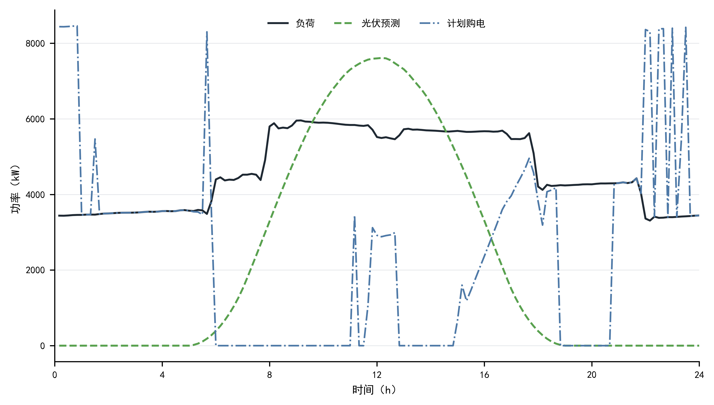

### 6.3 结果分析

连续线性规划储能调度方案的全天购电费用为35126.95元，无储能购电基线方案为48052.05元，费用减少12925.10元，即26.90%。全天计划购电量、充电量和放电量分别为59482.70、20740.67和16799.94 kWh。调度轨迹表明，储能在低价及光伏富余阶段补能，在较高电价阶段释放能量；这一机制还可由电价响应图和SOC轨迹交叉检查。

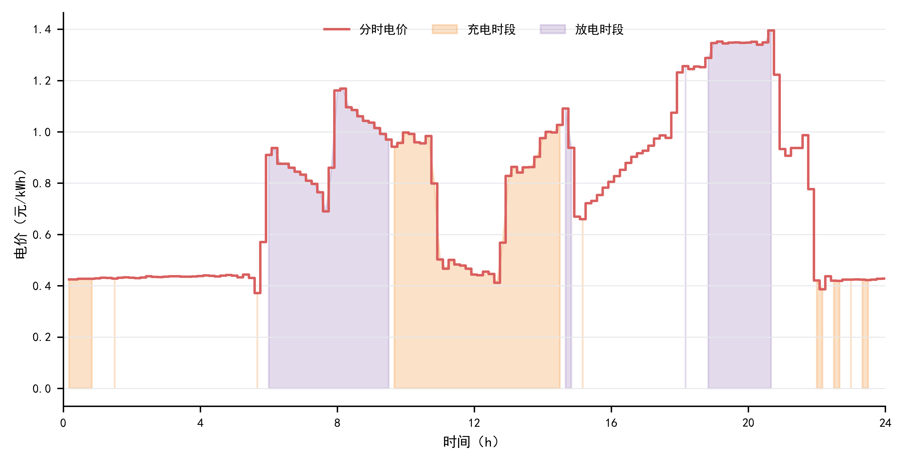

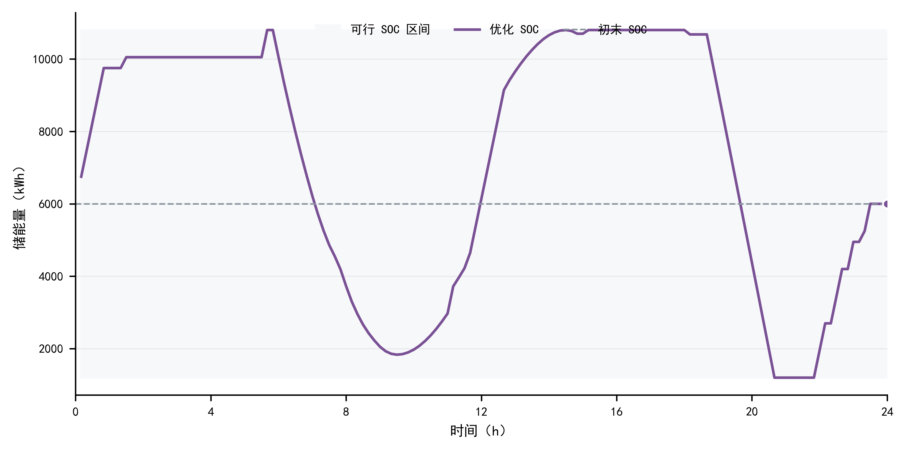

可行性方面，最大能量平衡残差为$1.14\times10^{-13}$ kWh，期末SOC误差为$6.37\times10^{-12}$ kWh，SOC始终位于1200—10800 kWh，且同时充放电次数为0。DP网格由400 kWh细化至50 kWh时，相对LP的费用差距由6.40%降至0.79%，说明离散近似随网格加密趋近连续解。

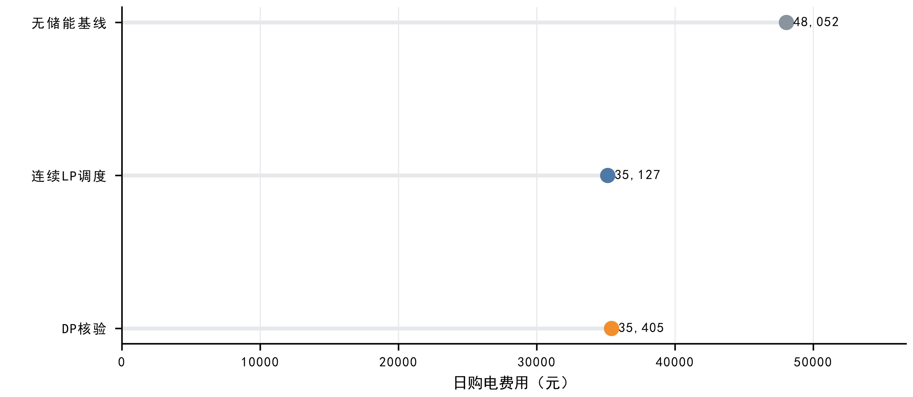

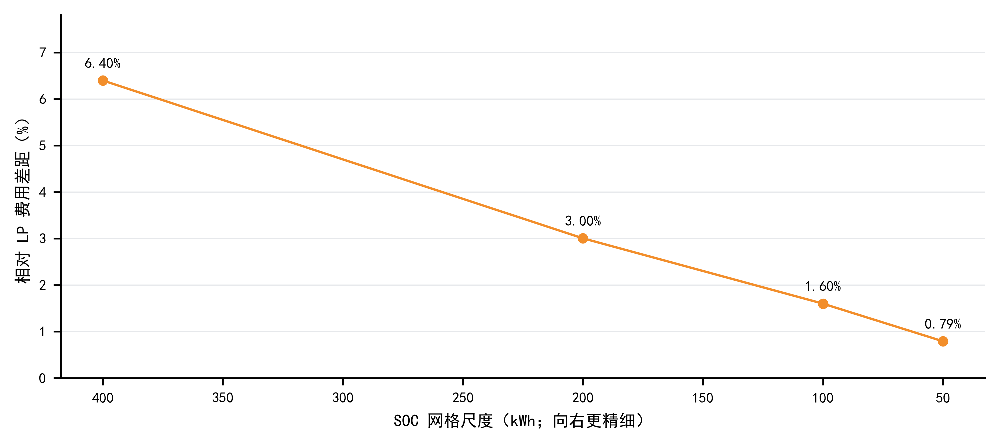

上述结果仅证明附件1给定典型日和现行效率口径下的确定性最优性，不能直接外推为全年收益率；电池退化、时间标签平移和效率扰动可能改变套利幅度。

## 7 问题2：非前视净负荷预测—日前优化

### 7.1 预测模型与方法选择

定义实际净负荷$n_{d,t}=l_{d,t}-v_{d,t}$。候选预测方案分别为前日同槽持久性预测、近7日同槽均值预测和严格非前视梯度提升净负荷预测。方法筛选阶段只使用2025年1月22日至28日的统一时间外PoC：三种方案的RMSE分别为1270.33、1044.67和301.91 kW，梯度提升方案的欠预测电量及紧急成本代理也最低，因此将其选入正式实验。PoC仅回答“哪种方法值得进入全年回放”，不作为最终结论。第7.3节的451.70 kW和334天费用才是2025年2月1日至12月31日严格非前视正式评价结果；最终评价以全年费用、紧急购电和尾部风险为主，RMSE与MAE仅作为预测层指标。<!-- from Q2-D01 -->

每日0:00以此前最多30日样本训练直方图梯度提升回归器。特征包括昨日同槽净负荷、近7日同槽均值、日内正余弦编码及七日周期索引。模型直接预测净负荷，而非分别预测负荷和光伏：

$$\widehat n_{d,t}=f_\theta(n_{d-1,t},\overline n_{d-7:d-1,t},\sin\omega t,\cos\omega t,d\bmod7).$$

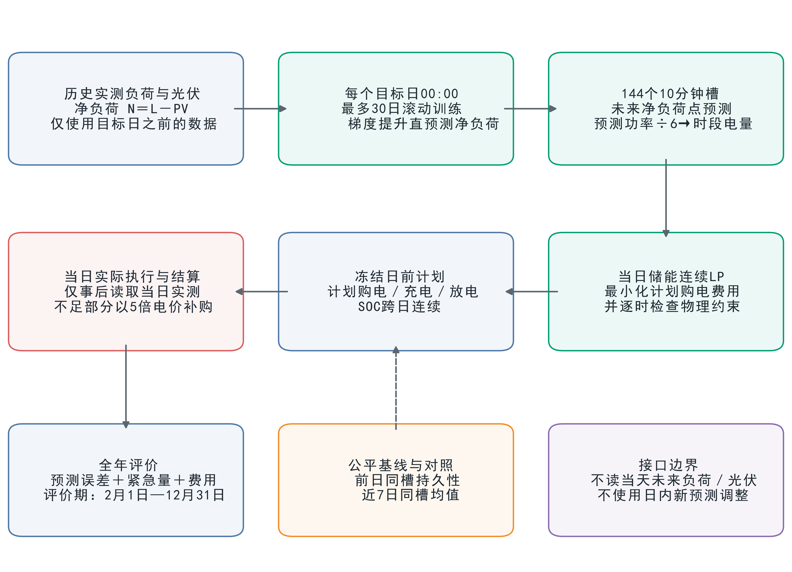

### 7.2 日前优化与实际回放

将预测功率转换为时段电量后，每日求解

$$\min\sum_{t}p_tg^P_{d,t},$$

$$g^P_{d,t}+x^d_{d,t}\ge \widehat n_{d,t}+x^c_{d,t},$$

并沿用公共SOC方程、功率边界和跨日状态连续约束。日前计划冻结后，以实际净负荷回放执行；供能不足部分为

$$g^E_{d,t}=\max\{n_{d,t}+x^c_{d,t}-x^d_{d,t}-g^P_{d,t},0\},$$

综合费用为

$$C_2=\sum_{d,t}p_tg^P_{d,t}+5p_tg^E_{d,t}.$$

每日LP只优化计划购电费用，5倍紧急费用在事后回放中结算。因此，给定预测的日内LP可达到连续模型最优，但全年综合费用不能称为随机优化理论全局最优。

### 7.3 结果分析

| 方法 | RMSE/kW | MAE/kW | 欠预测95%分位/kW | 综合费用/元 | 紧急购电/kWh |
|---|---:|---:|---:|---:|---:|
| 前日同槽持久性预测方案 | 1187.22 | 744.22 | 2234.52 | 22754290.24 | 2578728.30 |
| 近7日同槽均值预测方案 | 1006.53 | 794.97 | 1238.23 | 24745988.56 | 3134903.41 |
| 非前视梯度提升净负荷预测方案 | 451.70 | 312.31 | 636.69 | 16865002.84 | 1163433.11 |

非前视梯度提升净负荷预测方案相对前日同槽持久性预测方案的综合费用和紧急购电量分别下降25.88%和54.88%；相对近7日同槽均值预测方案分别下降31.85%和62.89%。联合密度图显示梯度提升方案的预测点云更贴近实际值与预测值相等的参考线；泰勒图从相关性、标准差比和中心化误差三个维度提供一致证据。残差时空热图同时表明误差并非均匀白噪声，其季节和日内结构仍值得在后续模型中显式建模。

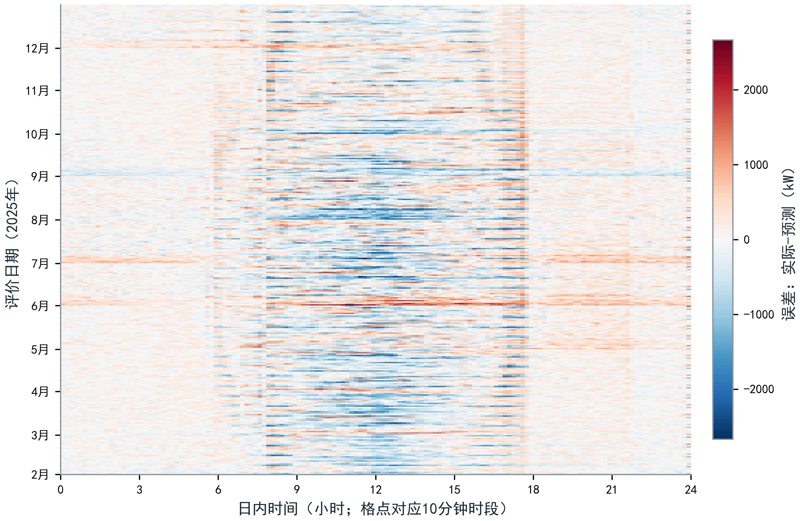

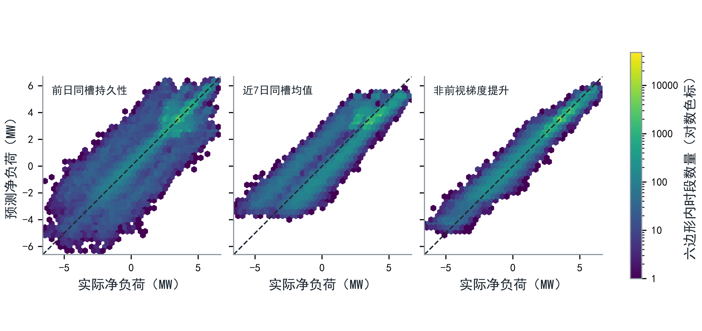

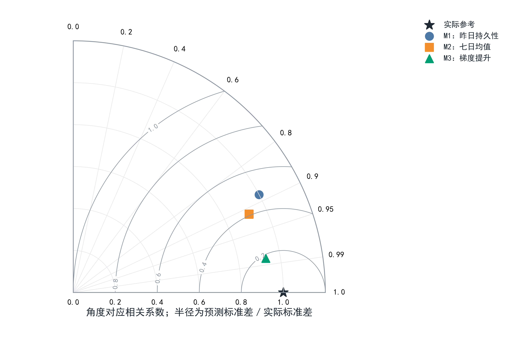

欠预测尾部超越曲线显示，在相同阈值下非前视梯度提升净负荷预测方案的大幅欠预测经验概率更低；这一预测层优势通过5倍紧急电价传导至运营层。逐日费用—紧急购电散点和累计费用差额轨迹进一步说明，低RMSE并非孤立统计改进，而是在统一回放口径下形成了费用优势。

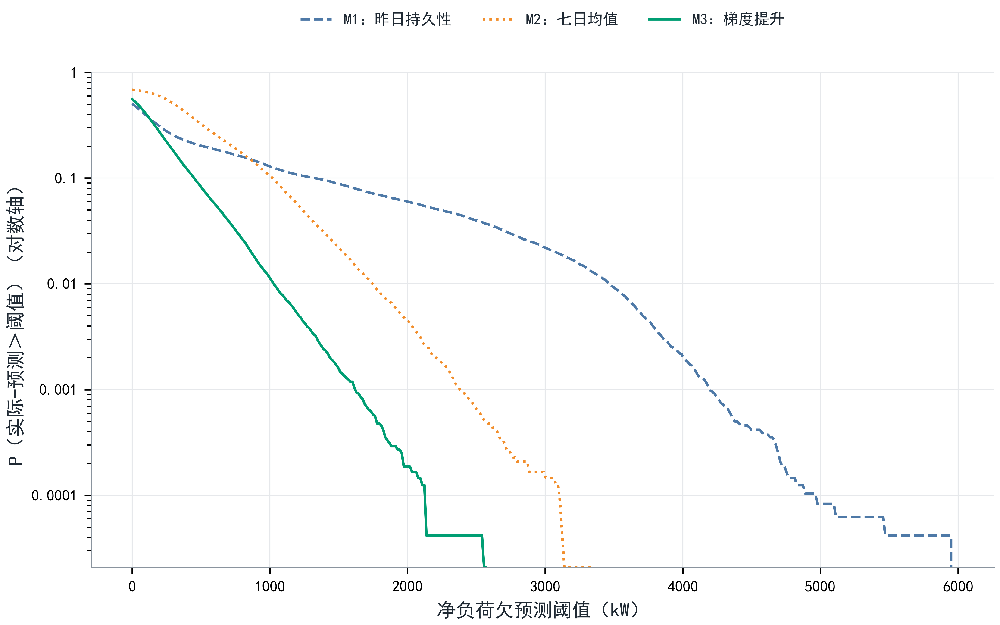

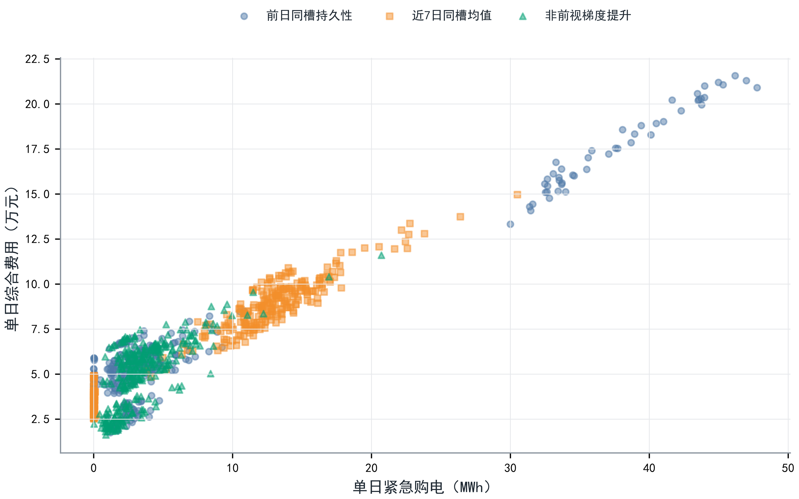

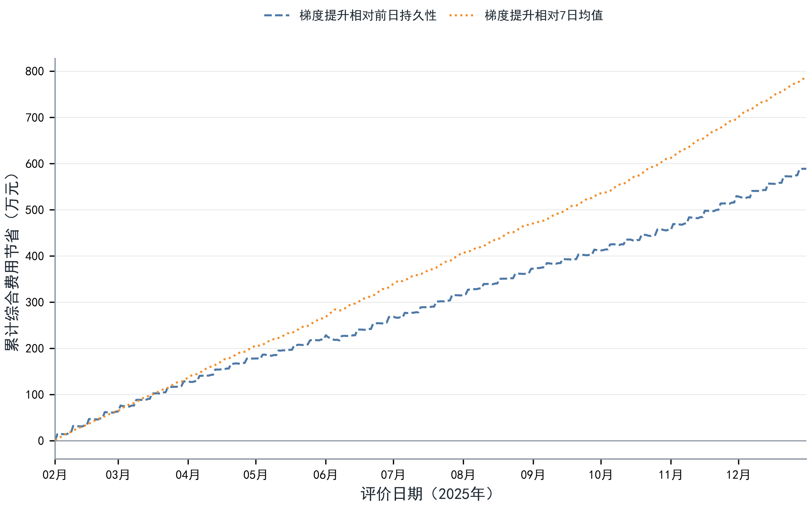

非前视梯度提升净负荷预测与日前线性规划方案的年末SOC为6000 kWh，最大平衡残差为$1.14\times10^{-13}$ kWh，未出现同时充放电。当前结果覆盖334天非前视回放；训练窗口、终端电量价值、多年份泛化和极端结构突变尚未得到独立验证。

为避免全年累计量掩盖时序波动，进一步按日期配对并采用7日移动块Bootstrap进行5000次重采样。相对前日同槽持久性基线，梯度提升方案的平均每日费用节省为17632.60元，95%区间为[16166.43, 18554.07]元；平均每日紧急购电减少4237.41 kWh，95%区间为[3776.10, 4480.58] kWh。按春、夏、秋、冬分别汇总，综合费用均下降22.61%—28.59%，紧急购电均下降46.58%—66.10%。这说明费用优势并非由单一季节驱动；但该检验仍属于同一年度内的时间稳定性证据，不能替代跨年度验证。

## 8 问题3：基于光伏更新的滚动调整

### 8.1 分位安全裕度模型

候选方法包括仅执行0:00计划且日内不调整方案、基于最新点预测的滚动调整方案，以及分位安全裕度滚动调整方案。方法筛选PoC覆盖2025年1月22日至2月4日：分位安全裕度方案的紧急购电代理为3762.09 kWh，较不调整方案和最新点预测方案分别下降83.16%和35.18%，因此进入334天正式回放。该短窗口结果只用于筛选方法，不与第8.2节的全年17.50%降幅混作同一统计量，也不预先断言全年费用最低。<!-- from Q3-D01 -->

在$r\in\{0,6,12,18\}$获得新光伏预测后，根据发布时刻$r$以前已经实现的光伏高估误差，即“预测光伏减实际光伏”，计算经验$\alpha$分位数$\rho_\alpha^{(r)}$，得到安全预测

$$\widehat P^{PV,safe}_{d,t}=\max\{\widehat P^{PV,(r)}_{d,t}-\rho_\alpha^{(r)},0\}.$$

每次更新冻结已执行前缀，仅重新优化未来购电和储能动作。令$\Delta g^-=[g^P-g^A]_+$、$\Delta g^+=[g^A-g^P]_+$，总费用为

$$C_3=\sum_{d,t}\left[p_tg^P_{d,t}-0.5p_t\Delta g^-_{d,t}+1.5p_t\Delta g^+_{d,t}+5p_tg^E_{d,t}\right].$$

多次滚动只保存各时段最后有效的调整后总购电量，并与0:00计划比较一次，避免重复结算。

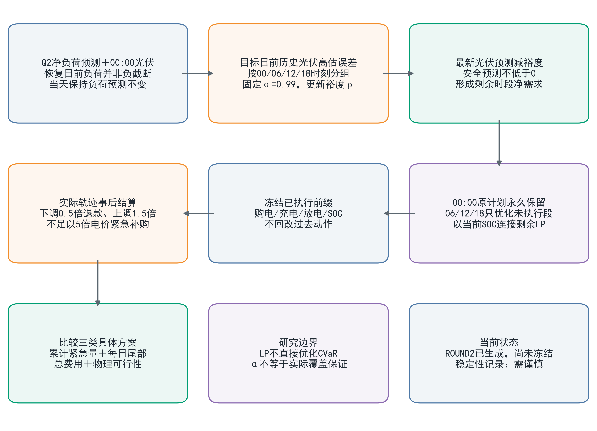

### 8.2 参数选择与结果

| $\alpha$ | 安全覆盖率 | 平均裕度/kW | 综合费用/元 | 紧急购电/kWh | 最坏日费用/元 |
|---:|---:|---:|---:|---:|---:|
| 0.80 | 0.8010 | 43.41 | 17873673.13 | 1305457.21 | 125705.21 |
| 0.90 | 0.8612 | 92.35 | 17627775.98 | 1186291.50 | 122807.49 |
| 0.95 | 0.8972 | 140.42 | 17487272.78 | 1087089.96 | 120574.60 |
| 0.975 | 0.9156 | 185.23 | 17456549.93 | 1020747.22 | 119219.00 |
| 0.99 | 0.9262 | 232.36 | 17469451.07 | 959911.02 | 118129.80 |

从0.80提高到0.975时，综合费用和紧急购电量同步下降；继续提高至0.99后，紧急购电再减少60836.20 kWh，但多付12901.15元。因此0.975附近偏向费用效率，0.99则位于更强调供电缺口控制的一端。按照已确定的风险优先口径，本文采用$\alpha=0.99$。<!-- from Q3-D01 -->

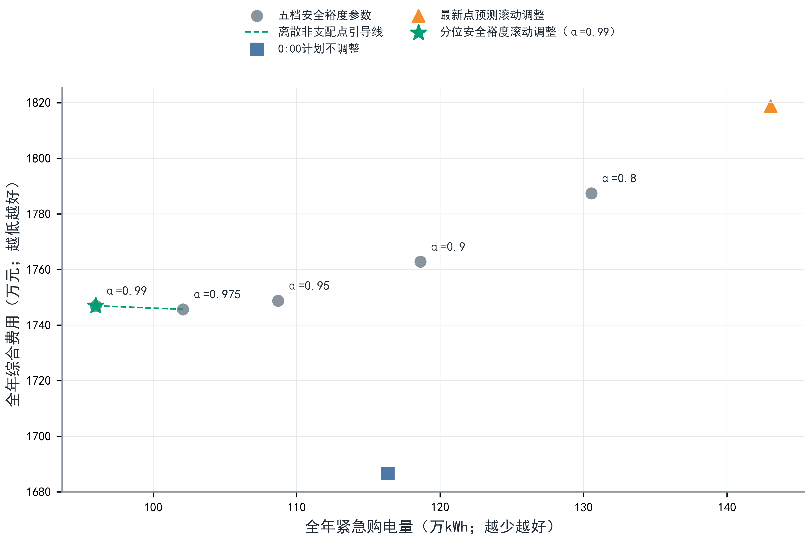

与仅执行0:00计划且日内不调整方案相比，分位安全裕度滚动调整方案在$\alpha=0.99$时的紧急购电量下降17.50%，每日紧急量CVaR95下降0.97%；与此同时，总费用、综合费用CVaR95和最坏日费用分别增加3.58%、2.17%和1.83%。这些结果说明0.99降低的是累计紧急购电依赖，并未在所有费用尾部指标上占优。与早期$\alpha=0.90$方案相比，$\alpha=0.99$的总费用减少158324.91元、紧急购电减少226380.48 kWh，表明参数重校准修正了过低裕度带来的执行缺口。

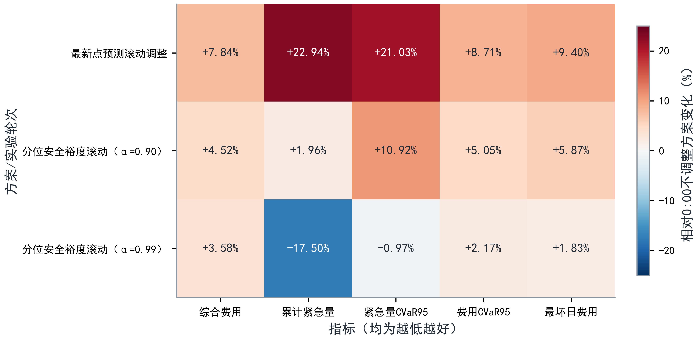

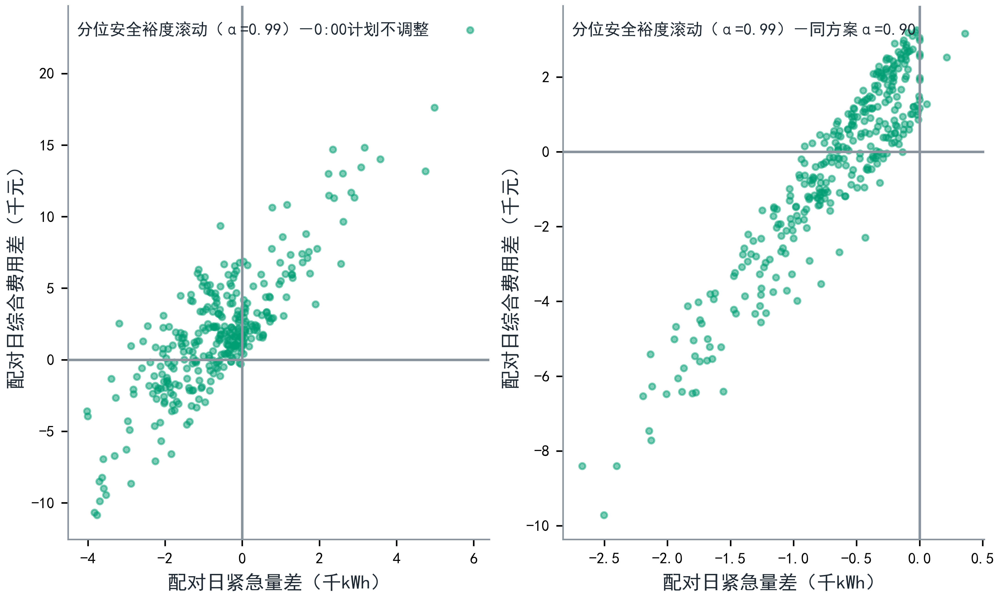

固定$\alpha=0.99$并不意味着安全裕度恒定。四个发布时刻分别使用目标日前的历史高估误差更新经验分位数，因而裕度会随历史样本积累而变化；不同发布时刻的误差尾部也呈现明显差异。

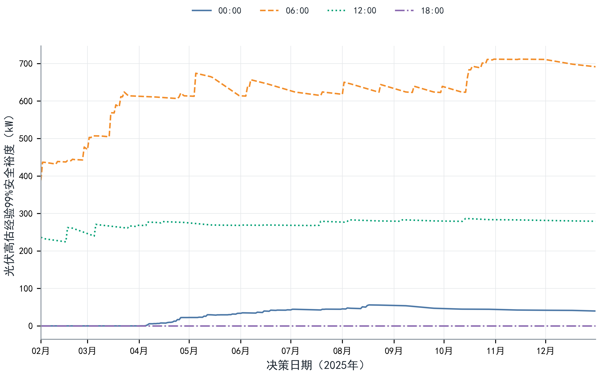

全年购电调整热图显示，滚动策略主要在日照时段重估未来购电量，且上调与下调并存。该图记录每个时段最终生效的调整结果，不代表四次发布的完整反事实快照。

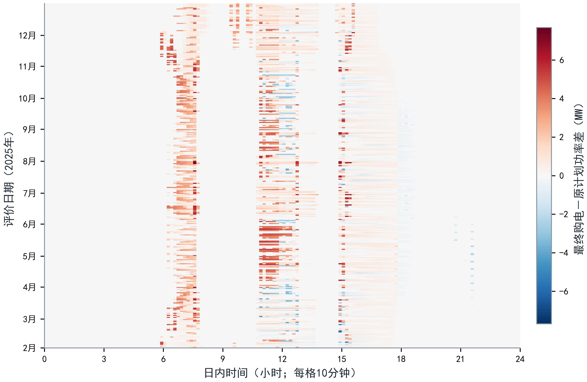

典型日联动图进一步展示了光伏安全预测、最终购电、储能充放电与SOC之间的同步变化；案例日期由事后规则选取，仅用于解释运行机制，不参与训练或参数选择。

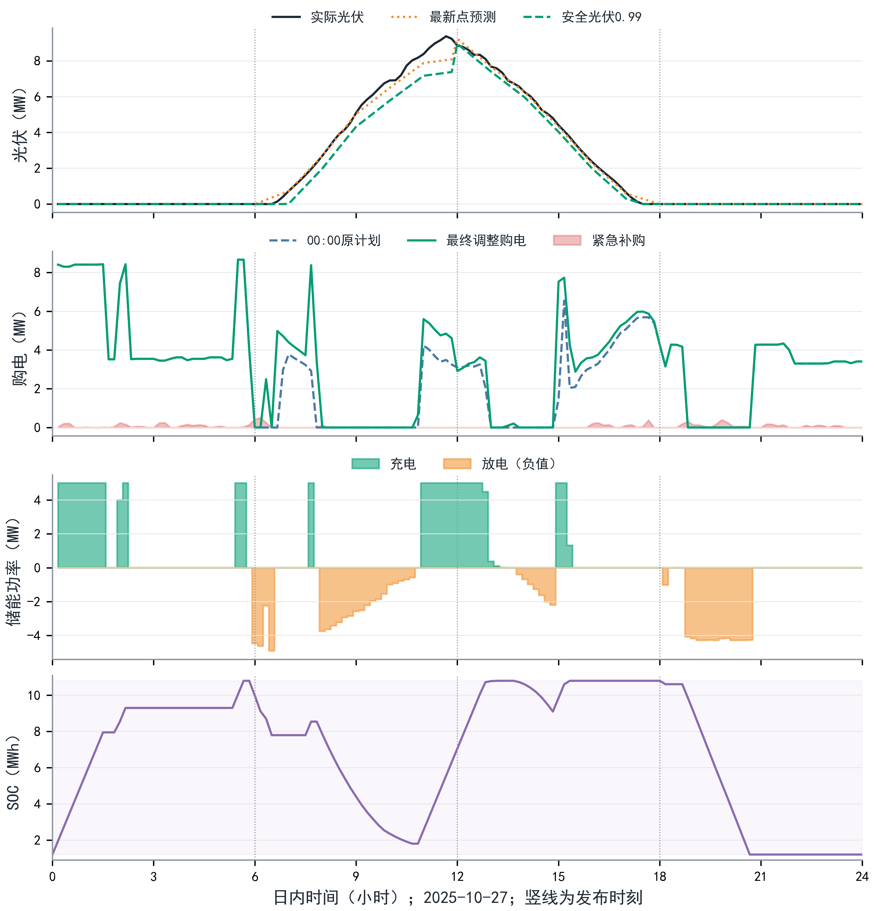

年末SOC为6000 kWh，最大平衡残差为$1.14\times10^{-13}$ kWh，同时充放电次数为0。现有稳定性判断为`needs_caution`：结论适用于2025年既定数据与价格规则，但缺少多年份和独立嵌套时间验证，故不能写成盲测统计保证或全面尾部风险优势。

配对时间检验进一步刻画了该取舍。相对不调整方案，0.99方案平均每日减少紧急购电609.68 kWh，7日移动块Bootstrap的95%区间为[446.39, 779.81] kWh，且四季累计紧急购电均下降13.53%—21.58%；但平均每日费用变化为增加1807.10元，其95%区间为增加[1348.42, 2272.44]元，四季费用均上升2.53%—4.46%。因此，“降低累计供电缺口”和“付出稳定可见的费用代价”在季节分组及块重采样下同时成立，这比只比较一个全年总数更能支撑0.99的风险优先解释。

## 9 问题4：波动电价情景鲁棒优化

### 9.1 历史价格情景模型

候选方法为波动电价下无储能购电基线方案、预知全天真实电价的完全信息参照方案，以及仅使用历史价格情景的鲁棒优化方案。电价按时间滚动获知，任何决策时刻不得使用同日未来真实价格；因此本文采用历史价格情景鲁棒优化方案，以决策日前历史真实日构造情景，并最小化最坏情景合同费用。完全信息方案仅作为不可实施的价格信息参照：它仍使用预测净负荷，因此不是实际综合费用的严格下界。<!-- from Q4-D01 -->

实际电价在日期和日内时段两个方向均有波动。该时空结构说明，固定分时电价不能代表全年价格环境，但整张真实价格图只用于事后描述，不能反向进入当天决策。

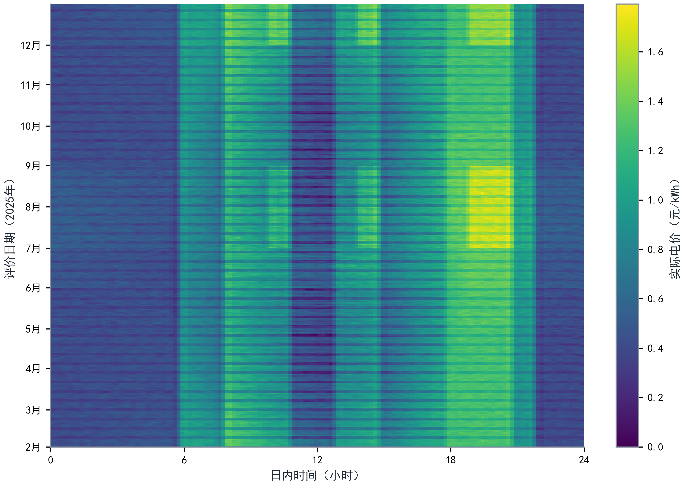

对每日决策，从此前真实日提取$K_p=7$条价格轨迹组成$\mathcal S_d$。0:00直接选取最近7个历史日；6:00、12:00和18:00则只依据已经实现的价格前缀计算RMSE，选择距离最小的7个历史日。情景日期严格早于目标日，已执行前缀被冻结，真实未来价格只用于事后评价。

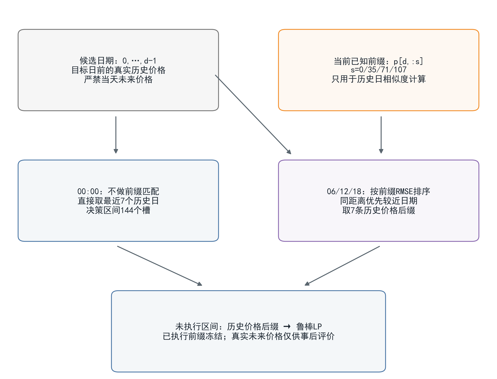

其中，$K_p$为历史价格情景数，$\mathcal S_d$为日期$d$的可用情景集合；再引入当日最坏情景合同费用上界$\xi_d$，将极小极大模型线性化：

$$\min \xi_d,$$

$$C^{\mathrm{contract}}_{d,s}(g,x^c,x^d)\le \xi_d,\qquad \forall s\in\mathcal S_d.$$

其中$C^{\mathrm{contract}}_{d,s}$表示日期$d$在价格情景$s$下的计划购电合同费用；对问题4-3，还包括相对0:00原计划的一次性增减购结算。事后由真实净负荷形成的5倍紧急购电费不直接进入该鲁棒LP目标，而是在实际轨迹回放时加入综合费用。问题4-2复用问题2的日前—执行结构；问题4-3复用问题3的滚动调整结构，并继承$\alpha=0.99$。历史价格情景鲁棒优化方案的每次决策只读取历史日期，未来价格泄漏次数为0；完全信息参照方案的泄漏计数为334，故只能作为价格信息参照。

最高费用日的情景线束表明，即使情景筛选严格非前视，真实未来价格仍可能落在七条历史轨迹包络之外；阴影表示情景最小—最大范围，而不是置信区间。

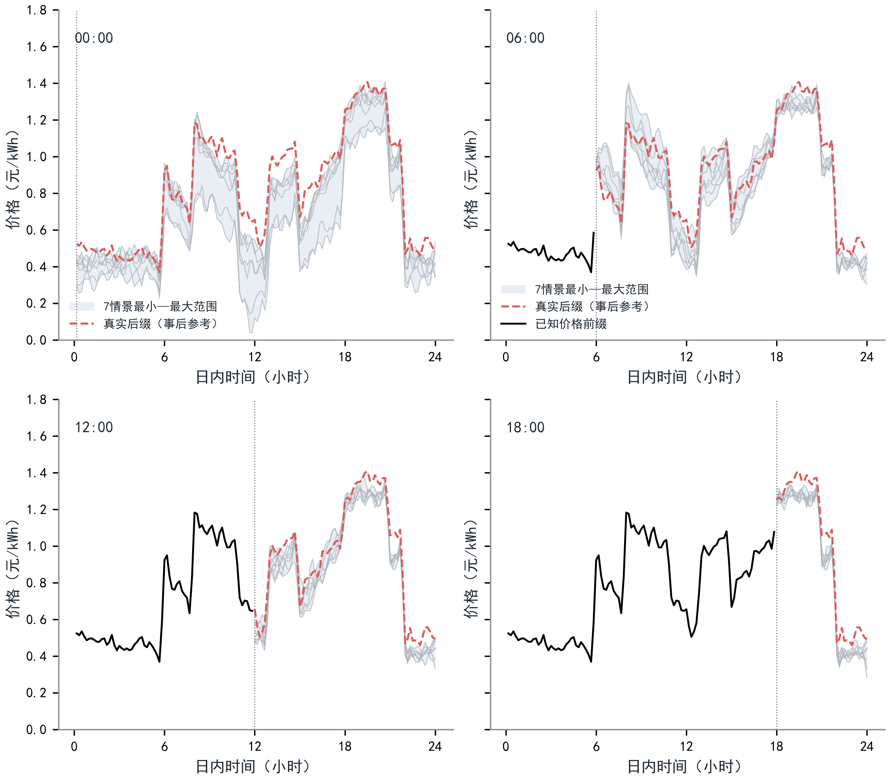

### 9.2 结果分析

| 子问题 | 方法 | 综合费用/元 | 紧急购电/kWh | 最坏日费用/元 | 未来价格泄漏次数 |
|---|---|---:|---:|---:|---:|
| Q4-2 | 波动电价下无储能购电基线方案 | 21032033.95 | 965426.51 | 124738.48 | 0 |
| Q4-2 | 预知全天真实电价的完全信息参照方案 | 17673760.07 | 1163674.25 | 126872.08 | 334 |
| Q4-2 | 历史价格情景鲁棒优化方案 | 17786226.74 | 1160750.17 | 127334.16 | 0 |
| Q4-3 | 0:00计划不调整基线方案 | 21524478.88 | 748591.45 | 121818.65 | 0 |
| Q4-3 | 预知全天真实电价的完全信息参照方案 | 18256358.00 | 963440.29 | 129270.63 | 334 |
| Q4-3 | 历史价格情景鲁棒滚动调整方案 | 18405519.64 | 966930.38 | 129720.12 | 0 |

累计费用—紧急购电联合图显示，两类实验中的基线方案均处于较高费用区域，而完全信息参照方案与历史价格情景鲁棒方案的全年累计指标接近；同时，Q4-3的三种策略整体表现出更低的累计紧急购电量。这一图只描述费用—风险位置，不构造不存在的连续Pareto前沿。

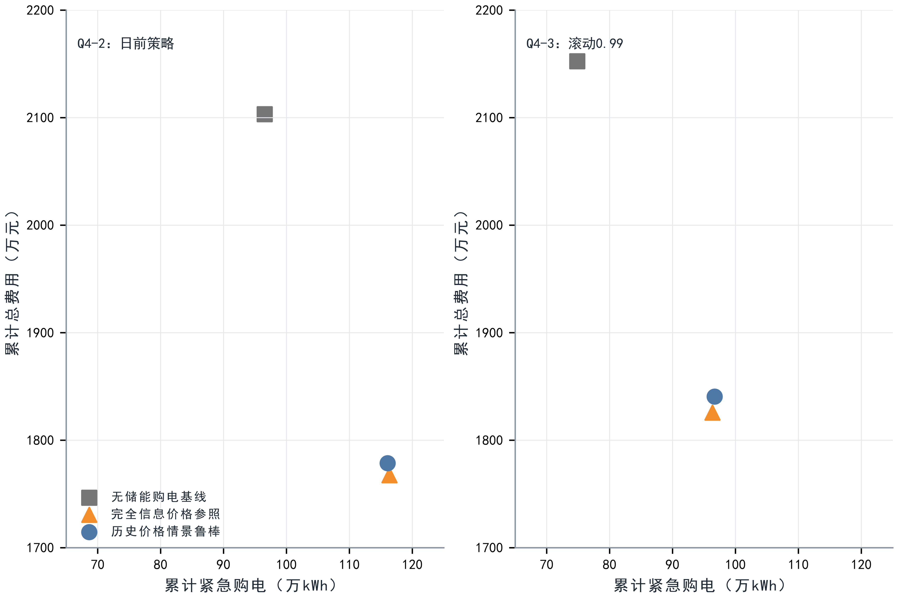

Q4-2中，历史价格情景鲁棒优化方案的综合费用比完全信息参照方案高112466.68元；Q4-3中，历史价格情景鲁棒滚动调整方案比完全信息参照方案高149161.64元，差额约占参照方案费用的0.82%。但逐日配对中，历史价格情景方案费用低于完全信息参照方案的日期分别有31天和24天，证明完全信息参照并非每日实际综合费用的严格下界；该差额只能描述当前回放中“可实施历史情景策略”与“预知价格参照”的累计费用距离，不能称为理论机会损失或信息价值上界。Q4-3的0:00计划不调整基线方案紧急购电量低于历史价格情景鲁棒滚动调整方案，但其综合费用高3118959.24元，说明紧急购电单指标不足以评价整体策略，必须同时考虑合同费用和储能套利。

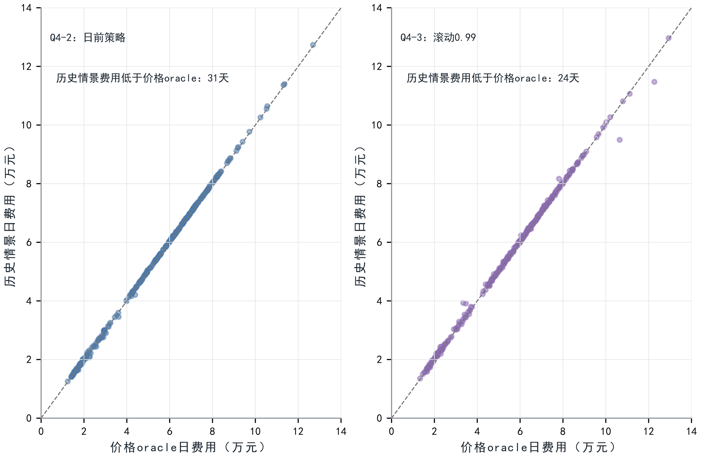

相对round1，Q4-3的综合费用、紧急购电量和最坏日费用分别下降194932.28元、228878.36 kWh和5464.21元，反映Q3安全裕度更新向波动电价场景的有效传播。历史价格情景鲁棒滚动调整方案的年末SOC为6000 kWh，最大平衡残差为$1.14\times10^{-13}$ kWh，未发生同时充放电；跨日SOC热图也显示状态在相邻日期之间连续传递，而不是每日重置。

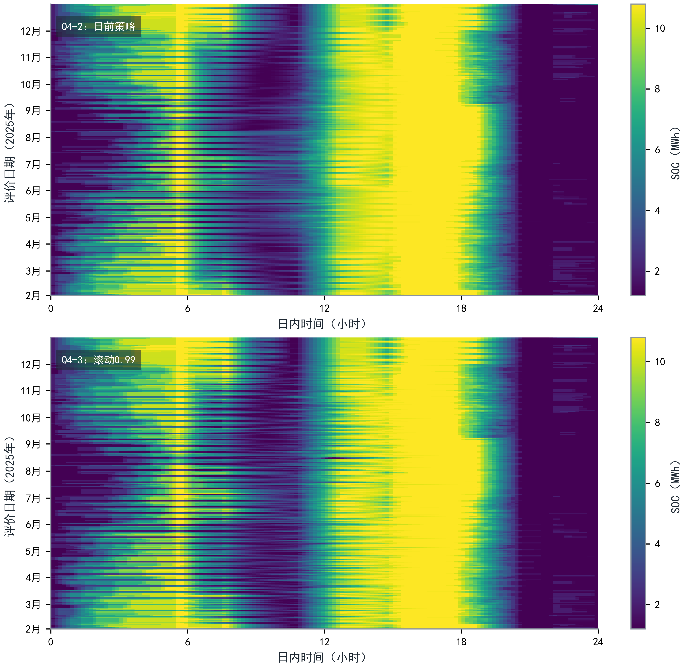

需要强调的是，7条历史情景不能保证覆盖未出现过的极端电价。对Q4-2同一计划的复核显示，有101天的实际计划费用超过七历史情景中记录的最坏计划费用。因此，鲁棒目标只对所选有限情景集合成立，不构成真实未来费用保证。

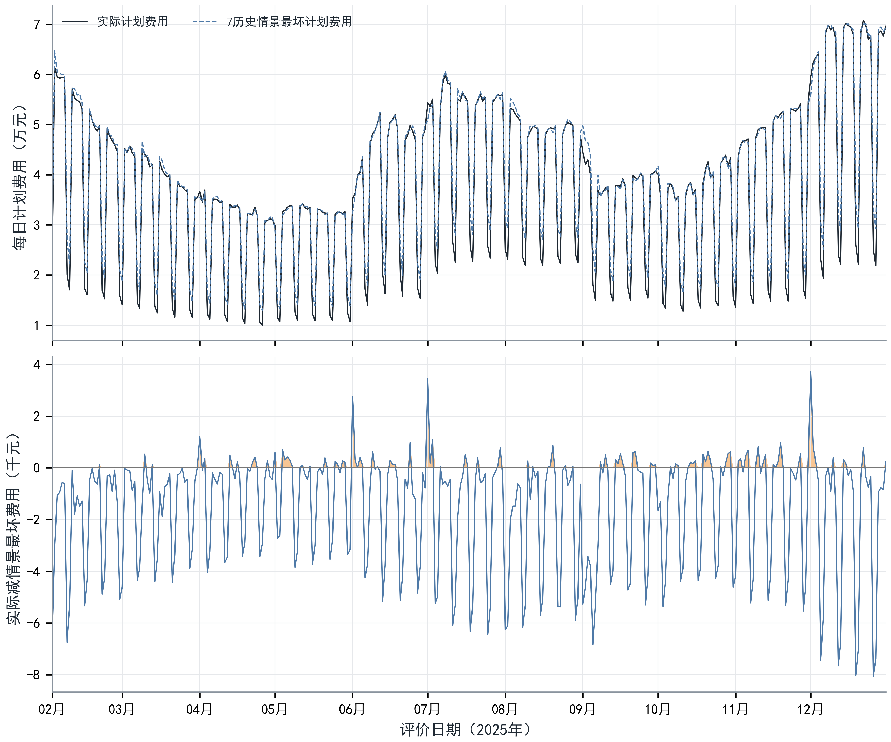

按日期配对后，历史价格情景方案相对无储能基线的费用优势在四季均保持：Q4-2下降13.12%—17.46%，Q4-3下降12.23%—16.41%。7日移动块Bootstrap显示，Q4-2和Q4-3平均每日费用节省的95%区间分别为[9146.58, 10174.32]元和[8668.81, 9867.12]元。另一方面，相对完全信息参照，历史情景方案的平均每日费用差额区间分别为增加[298.52, 369.05]元和[339.42, 546.94]元。该结果支持“可实施性只付出有限累计费用距离”的样本内结论，但不改变101天情景包络失效所揭示的外推风险。

## 10 稳健性与敏感性分析

问题1通过动态规划网格加密检验连续LP数值结果：网格从400 kWh细化至50 kWh，相对费用差距从6.40%收敛至0.79%。这一检查支持求解结果的一致性，但不替代时间标签、效率和退化成本敏感性。若充放电效率或时段映射发生改变，低价充电与高价放电的净收益会随之变化。

问题2采用三种预测路线进行同源对比，并同时检查预测误差、欠预测尾部、全年费用和紧急购电。非前视梯度提升净负荷预测方案在这四类指标上相对前日同槽持久性预测方案均改善，且334天执行中无未来信息泄漏。7日移动块Bootstrap给出的平均每日费用节省95%区间为[16166.43, 18554.07]元，四季费用降幅均超过22%，表明结论对年度内部的短期相关性和季节划分不敏感。当前尚未完成训练窗口、终端状态价值和跨年度验证，因而不对多年泛化作强结论。

问题3完成了$\alpha\in\{0.80,0.90,0.95,0.975,0.99\}$的全量重算。0.95被0.975在费用和紧急购电两个指标上同时支配；0.975与0.99构成局部费用—风险前沿。分位安全裕度滚动调整方案在$\alpha=0.99$时相对0:00计划不调整方案降低累计紧急购电，却使综合费用CVaR95和最坏日费用上升。块重采样和季节分组进一步确认“紧急量下降、费用上升”是稳定方向，而非偶然全年汇总；稳定性结论仍保持`needs_caution`，因为这些证据不能证明全面尾部风险优势。

问题4通过信息时间戳审计区分可实施的历史价格情景鲁棒方案和预知全天真实电价的完全信息参照方案，并把Q3的参数变化传播至Q4-3。历史价格情景鲁棒方案的未来价格泄漏为0，对无储能基线的费用优势在四季均成立；累计费用与完全信息参照方案相差约0.82%。但逐日配对已证明完全信息参照不是严格下界，且实际计划费用在101天超过有限情景最坏值。历史情景覆盖范围、情景数$K_p$和极端价格外推尚未开展系统敏感性分析。

上述置信区间均由已有334天逐日结果计算，不重新拟合模型或修改优化输出。重采样以7个连续日期为块、固定随机种子20260913并重复5000次，以保留周尺度相关性；区间反映本年度样本内时间稳定性，而不是对未来年份的概率保证。

## 11 模型评价

### 11.1 主要贡献与优点

第一，四问共享同一能量平衡和储能状态内核，单位、效率、边界和结算口径一致，降低了分问建模产生隐性矛盾的风险。第二，建立“预测指标—调度计划—实际回放—风险评价”闭环，避免仅凭RMSE选择模型；问题2直接量化预测误差经5倍紧急电价向运营费用的传导。第三，在同一框架中同时实现日前、四时点滚动和历史价格情景三个时间尺度，并用冻结前缀和泄漏计数把信息可实施性转化为可检查条件。第四，参数选择不以单一最优值包装，而是通过费用—紧急购电前沿、CVaR反证、季节分组和移动块Bootstrap共同说明风险偏好。第五，连续LP、滚动LP和鲁棒LP均具有较强可解释性，结果可逐时写回官方模板并复核。

### 11.2 局限性

第一，模型未计入电池容量衰减和寿命成本，频繁充放电的长期经济性可能被高估。第二，问题2的特征仍以滞后与周期信息为主，残差热图显示的季节—日内结构尚未被完全吸收。第三，问题3的0.99方案偏向累计紧急量控制，但并未改善所有费用尾部指标；季节分组和块重采样只能增强年度内部证据，不能替代独立嵌套或跨年度验证。第四，问题4仅使用有限历史价格情景，不能覆盖历史未出现的价格突变。第五，时间标签整体平移、往返效率替代口径和终端电量价值仍需补充敏感性实验。因此，本文的核心结论限于题设设备参数、2025年数据和给定结算规则。

## 12 结论

本文建立了由确定性调度、净负荷预测—优化、日内分位安全滚动调整和历史价格情景鲁棒优化组成的多时间尺度微电网运行体系。

对于问题1，连续LP在给定单日条件下将购电费用由48052.05元降至35126.95元，节省26.90%，同时满足能量平衡、储能边界和首末状态约束；DP网格加密结果与其保持数值一致。对于问题2，严格非前视梯度提升模型降低净负荷预测误差，并使334天综合费用和紧急购电量相对持久性基线分别下降25.88%和54.88%；四季降幅方向一致，且块重采样区间不跨越零，说明预测改善在本年度回放中稳定转化为运营收益。

对于问题3，日内新预测值得采用，但不能只执行无裕度点预测。分位安全裕度0.99相对0:00计划不调整方案减少17.50%的紧急购电，代价是综合费用增加3.58%；因此其结论是风险优先的费用—供电缺口折中，而不是最低费用。对于问题4，仅使用历史价格情景的鲁棒优化方案保持零未来价格泄漏；Q4-3综合费用比预知全天真实电价的完全信息参照高约0.82%，但该参照不是严格下界。有限情景最坏值在101个评价日被实际计划费用超过，说明情景外极端价格仍需额外压力测试。

综上，光储微电网的有效调度依赖于物理可行、预测准确、信息非前视和风险偏好四者的共同约束。后续研究可加入电池退化成本、终端电量价值、多年份滚动验证以及更系统的价格情景生成方法。

## 13 数据、代码与复现说明

原始附件保持只读，预处理只执行日期向下填充、整点预测到10分钟尺度插值和功率—电量单位换算。四问主程序分别位于`src/Q1/`至`src/Q4/`，统一入口为`src/run_all.py`；正式指标、逐日表和官方模板输出分别保存在`results/`与`output/`。论文中的核心数字冻结在`paper/frozen_numbers.json`，其中同时记录对应指标文件的SHA-256，以便在修改图表或正文后检查数字源是否发生变化。时间稳定性证据由`src/analysis/analyze_submission_robustness.py`从既有逐日结果生成，固定随机种子为20260913。项目复现材料见GitHub仓库`https://github.com/xinyi0606/math/tree/dev-pc-a`。

## 参考文献

[1] 李德兴. 分时电价下光储微电网多时间尺度协调运行策略研究[D]. 南昌大学, 2025.

[2] 袁志鹏. 计及预测不确定性的智能微电网协调控制与优化运行研究[D]. 北京交通大学, 2024.

[3] 张宇航. 考虑源荷不确定性的楼宇微电网多时间尺度供需侧管理研究[D]. 山东大学, 2024.

[4] Friedman J H. Greedy function approximation: A gradient boosting machine[J]. The Annals of Statistics, 2001, 29(5): 1189-1232. DOI: 10.1214/aos/1013203451.

[5] Sachs J, Sawodny O. A two-stage model predictive control strategy for economic diesel-PV-battery island microgrid operation in rural areas[J]. IEEE Transactions on Sustainable Energy, 2016, 7(3): 903-913. DOI: 10.1109/TSTE.2015.2509031.

[6] Bertsimas D, Sim M. The price of robustness[J]. Operations Research, 2004, 52(1): 35-53. DOI: 10.1287/opre.1030.0065.

[7] Rockafellar R T, Uryasev S. Conditional value-at-risk for general loss distributions[J]. Journal of Banking & Finance, 2002, 26(7): 1443-1471. DOI: 10.1016/S0378-4266(02)00271-6.
