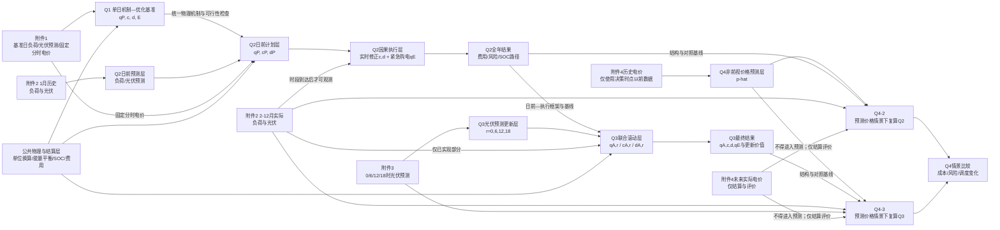

# Q1-Q4 问题依赖图与接口说明

> 状态：**INITIAL / READY_FOR_METHOD-SELECTION**
> 建立日期：2026-09-12
> 依据：`planning/parse/problem_parse.*`、`planning/modeling_conventions.md`、`planning/symbol_table.md`、`planning/model_assumptions.md`、`data/data_report.md`
> 图形选择：问题依赖属于流程/架构关系，不属于纯数据图。按 `scipilot-figure-skill` 的适用边界，不生成折线、柱状、热力或其他数据图；采用可审查、可版本管理的 Mermaid 依赖图和接口矩阵。

## 1. 总体依赖图



主链不是四个独立模型，而是：

`Q1公共机制 → Q2日前预测—计划—因果执行 → Q3日内预测更新与联合滚动 → Q4在非前视价格预测情景下分别复算Q2/Q3并比较`。

## 2. 依赖类型

| 类型 | 含义 | 典型传递对象 | 核心约束 |
|---|---|---|---|
| 结构依赖 | 下游复用上游物理与费用结构 | 能量平衡、储能状态、充放电互斥、购电结算 | 下游只能扩展，不能悄然改写冻结机制 |
| 数据依赖 | 附件字段进入预测、计划、执行或评价层 | `l,v,\widehat l,\widehat v,p,\widehat p` | 必须标注数据在决策时点是否可得 |
| 状态依赖 | 储能状态跨时段、跨日和跨滚动窗口传递 | `E_{n,t}` | Q2-Q4不得逐日任意重置，研究期末为6000 kWh |
| 决策依赖 | 上游计划成为下游调整或执行基准 | `q^P,c^P,d^P,q^{A,r},c^{A,r},d^{A,r}` | 过去时段冻结；未来实际值禁止前视 |
| 评价依赖 | 同一基线和指标用于判断新增信息价值 | `C^{year},Q^E,\Delta C,\Delta Q^E` | 比较必须控制除目标情景外的其他条件 |

## 3. 各问题接口契约

### 3.1 Q1：公共机制基准

| 项目 | 内容 |
|---|---|
| 输入 | 附件1基准日负荷、光伏预测、固定分时电价；储能参数 |
| 内部对象 | `q^P_t,c_t,d_t,E_t,v^{use}_t` |
| 输出给下游 | 功率—电量换算、能量平衡、储能状态转移、充放电互斥、弃光/禁止售电规则、费用核算方式和可行性检查模板 |
| 不向下游传递 | Q1“全日曲线完全已知”假设和每日 `E_0=E_{144}` 约束 |
| 验收 | 单日能量平衡无违例、SOC不越界、日首尾相等、费用可复核 |

### 3.2 Q2：日前计划与实时储能修正

| 项目 | 内容 |
|---|---|
| 上游依赖 | Q1公共机制；附件2截至当日0:00的历史；固定分时电价；当前SOC |
| 日前预测输出 | `\widehat l_{n,t\mid0}`、`\widehat v_{n,t\mid0}`及必要的不确定性描述（方法待选） |
| 日前计划输出 | `q^P_{n,t},c^P_{n,t},d^P_{n,t}` |
| 执行输入 | 时段 `t` 到达后已实现的 `l_{n,t},v_{n,t}` 和当前 `E_{n,t}` |
| 执行动作 | 因果修正最终 `c_{n,t},d_{n,t}`；剩余缺口形成 `q^E_{n,t}` |
| 输出给Q3/Q4 | 日前—执行双层结构、全年SOC路径、计划费用、紧急购电风险及代表日结果 |
| 验收 | 无未来实际值泄漏；逐时平衡与SOC可行；跨日连续；年末6000 kWh；紧急购电按5倍结算 |

### 3.3 Q3：光伏更新驱动的联合滚动

| 项目 | 内容 |
|---|---|
| 上游依赖 | Q2日前计划、实时执行框架和成本基线；附件3光伏预测更新 |
| 发布时间 | `r\in\{0,6,12,18\}`；每次只作用于尚未执行时段 |
| 滚动变量 | `q^{A,r}_{n,t},c^{A,r}_{n,t},d^{A,r}_{n,t}` |
| 最终执行 | 各时段采用当时最后有效版本并结合已实现信息形成 `q^A_{n,t},c_{n,t},d_{n,t},q^E_{n,t}` |
| 结算接口 | 最终 `q^A` 只与原计划 `q^P` 比较一次，形成上调、取消和紧急购电费用 |
| 输出给Q4 | 联合滚动框架、无更新基线、更新后结果、`\Delta C`与`\Delta Q^E` |
| 验收 | 过去时段不可回写；无光伏未来实际值泄漏；费用不重复；同一基线下证明更新是否有价值 |

### 3.4 Q4：价格预测支持的情景分析—优化

| 项目 | Q4-2 | Q4-3 |
|---|---|---|
| 结构来源 | 完整复用Q2日前—执行结构 | 完整复用Q3联合滚动结构 |
| 新增输入层 | 在0:00形成未来价格预测 `\widehat p_{n,t\mid0}` | 在0:00形成日前价格预测；若候选方法允许，可在 `r=6,12,18` 用当时历史刷新 `\widehat p_{n,t\mid r}` |
| 禁止输入 | 决策时点之后的附件4实际电价 | 决策时点之后的附件4实际电价 |
| 执行与结算 | 实际价格到达后按 `p^{var}_{n,t}` 结算Q2型计划和紧急购电 | 实际价格到达后按 `p^{var}_{n,t}` 结算Q3型计划、调整和紧急购电 |
| 比较对象 | 固定电价Q2 vs 预测波动电价Q4-2 | 固定电价Q3 vs 预测波动电价Q4-3 |
| 控制变量 | 相同负荷/光伏路径、初始SOC、预测切分、物理约束和评价指标 | 同左 |

说明：Q4引入价格预测，但价格预测是构造可实施价格情景的输入层；主要交付仍是不同价格环境下Q2/Q3策略的重优化与比较，因此保持“情景分析—优化混合问题”的已确认分类。

## 4. 边清单（可直接转为程序模块接口）

| 边ID | 从 | 到 | 传递对象 | 可用时点 | 强制性 | 若断裂的后果 |
|---|---|---|---|---|---|---|
| E01 | Q1 | Q2 | 物理约束、状态式、单位与可行性检查 | 建模前 | 必须 | 四问能量口径不一致 |
| E02 | Q1 | Q3 | Q1公共机制，经Q2扩展后复用 | 建模前 | 必须 | 滚动优化可能使用另一套储能口径 |
| E03 | 历史负荷/光伏 | Q2预测层 | 截至0:00的历史及日历特征 | 日前 | 必须 | 无法形成可实施日前预测 |
| E04 | Q2预测层 | Q2计划层 | `\widehat l,\widehat v`及不确定性摘要 | 日前 | 必须 | 预测与优化脱节 |
| E05 | Q2计划层 | Q2执行层 | `q^P,c^P,d^P,E_{n,0}` | 日前完成后 | 必须 | 无法评价计划偏差和recourse价值 |
| E06 | 当期实测 | Q2执行层 | 已实现 `l,v,E` | 每个时段到达后 | 必须 | 不能实施因果储能修正 |
| E07 | Q2执行层 | Q3 | 双层框架、成本与风险基线 | Q3建模前 | 必须 | 无法隔离日内新预测价值 |
| E08 | 附件3 | Q3滚动层 | `\widehat v_{n,t\mid r}` | 0/6/12/18时 | 必须 | Q3退化为Q2 |
| E09 | Q3滚动层 | Q3执行 | 最新有效 `q^{A,r},c^{A,r},d^{A,r}` | 各发布时间后 | 必须 | 最终执行版本不唯一 |
| E10 | 历史价格 | Q4价格预测层 | 决策时点以前的 `p^{var}` | 日前/滚动时 | 必须 | 价格预测产生前视或无输入 |
| E11 | Q4价格预测层 | Q4-2/Q4-3 | `\widehat p_{n,t\mid r}`及情景/误差描述 | 相应决策时点 | 必须 | Q4无法非前视优化 |
| E12 | Q2 | Q4-2 | 除价格外的全部结构与基线 | Q4-2建模前 | 必须 | 情景差异不可归因于价格 |
| E13 | Q3 | Q4-3 | 除价格外的全部结构与基线 | Q4-3建模前 | 必须 | 情景差异不可归因于价格 |
| E14 | 实际价格 | Q4评价层 | `p^{var}_{n,t}` | 时段实现后 | 必须 | 无法计算实际结算费用 |
| E15 | Q4-2/Q4-3 | Q4比较 | 成本、SOC、充放电、弃光与紧急购电指标 | 全部复算后 | 必须 | 无法形成情景结论 |

## 5. 时间与状态传递

### 5.1 Q2因果执行顺序

```text
日期n的0:00：读取历史、日历、固定/预测电价与E[n,0]
        ↓
生成日前预测 → 制定qP[n,:]、cP[n,:]、dP[n,:]
        ↓
时段t开始：只观测截至t已实现的负荷、光伏和SOC
        ↓
修正当期/后续储能动作 → 执行c[n,t]、d[n,t]
        ↓
剩余缺口由qE[n,t]补足 → 更新E[n,t+1]
        ↓
E[n,144]传给E[n+1,0]
```

### 5.2 Q3/Q4-3滚动顺序

```text
r=0：形成日前负荷/光伏/价格预测与初始计划
  ↓
r=6、12、18：读取截至r的实测与新版预测
  ↓
冻结所有已执行时段
  ↓
联合更新未来qA,r、cA,r、dA,r
  ↓
逐时因果执行并由紧急购电兜底
  ↓
保留每个时段最后有效的qA，统一结算一次
```

## 6. 信息可用性与防泄漏矩阵

| 信息 | Q1 0:00 | Q2/Q4-2 0:00 | Q3/Q4-3 0:00 | Q3/Q4-3 在r时 | 执行/评价 |
|---|:---:|:---:|:---:|:---:|:---:|
| 附件1基准日曲线 | 可用 | 仅固定电价/基准信息 | 仅固定电价/基准信息 | 不新增 | 可复核 |
| 截至决策时点的历史负荷/光伏 | 不需要 | 可用 | 可用 | 可用 | 可用 |
| 当天未来实际负荷/光伏 | Q1按给定基准处理 | 禁止 | 禁止 | 仅已实现部分可用 | 实现后可用 |
| 附件3相应发布时间预测 | 不需要 | 不需要 | 0时版本可用 | 当前及此前版本可用 | 可评价 |
| 当天未来附件4实际电价 | 不适用 | Q4-2禁止 | Q4-3禁止 | 未实现部分禁止 | 实现后结算 |
| 截至决策时点的历史电价 | 不适用 | Q4-2可用 | Q4-3可用 | Q4-3可用 | 可用 |
| 储能状态 `E_{n,t}` | 可用 | `E_{n,0}`可用 | `E_{n,0}`可用 | 当前状态可用 | 持续更新 |

## 7. 评价指标依赖

| 结论 | 必须依赖的基线 | 必须保持一致 | 至少报告 |
|---|---|---|---|
| Q2策略有效 | 简单日前预测—计划基线及oracle下界 | 数据切分、物理约束、初始/终端SOC | 年费用、紧急购电量/时段、可行性、预测误差 |
| Q3新预测是否值得采用 | 同一Q2计划下“不更新”方案 | 初始计划、实际路径、结算式 | `\Delta C`、`\Delta Q^E`、调整次数/规模、SOC与弃光变化 |
| Q4价格波动影响 | 固定电价Q2/Q3 | 负荷/光伏、预测切分、储能参数、执行规则 | 价格预测误差、费用差、紧急购电差、储能行为变化 |
| 预测复杂度是否值得 | 简单可解释预测基线 | 滚动回测窗口和下游优化器 | MAE/RMSE与下游费用/风险双重指标 |

## 8. 对 `method-selector` 的硬约束

1. Q1候选必须共享同一物理与费用层，不得通过改变储能效率或终端条件获取表面优势。
2. Q2候选必须显式区分日前 `c^P,d^P` 与因果执行 `c,d`，并说明recourse只使用已实现信息。
3. Q3候选必须允许联合更新未来 `q^{A,r},c^{A,r},d^{A,r}`，且过去时段严格冻结。
4. Q4候选必须包含非前视价格预测或价格情景生成；“直接读取未来实际价格”只能作为oracle对照。
5. 所有预测候选都要同时比较预测误差与下游费用/紧急购电，不能只凭RMSE选方法。
6. 所有优化候选必须复用统一符号表和26条已确认题面/机制假设；方法诱导假设另行回填。
7. Q4-2/Q4-3与Q2/Q3的比较必须控制除价格层之外的变量，避免混杂归因。

## 9. 完整性与一致性检查

- [x] Q1→Q2→Q3主链和Q2/Q3→Q4双分支均已表示。
- [x] 附件1-4分别进入预测、计划、执行或评价层的位置已明确。
- [x] 日前计划、滚动调整、实时执行和紧急购电四层变量已分开。
- [x] Q2实时储能修正只使用已实现负荷、光伏和SOC，不产生前视。
- [x] Q3联合调整未来购电与储能计划，过去时段不可回写。
- [x] Q4实际未来价格不得进入预测，oracle与主策略边界明确。
- [x] Q1日循环与Q2-Q4跨日/年末状态边界未混用。
- [x] Q3/Q4费用只对最终调整购电量结算一次。
- [x] 跨情景比较的控制变量、基线和最低报告指标已登记。
- [x] 方法选择阶段需要遵守的七项接口硬约束已列出。

## 10. 变更记录

| 日期 | 版本 | 变更 | 依据 |
|---|---|---|---|
| 2026-09-12 | v1.0 | 建立Q1-Q4依赖图、接口契约、边清单、时序、防泄漏矩阵、评价依赖和方法选择约束 | 已确认题面、冻结口径、统一符号表、全局假设及用户授权的执行边界 |
